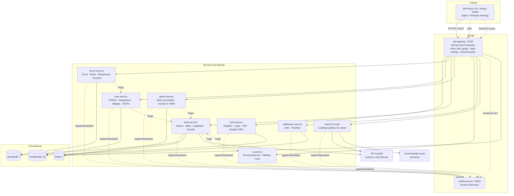
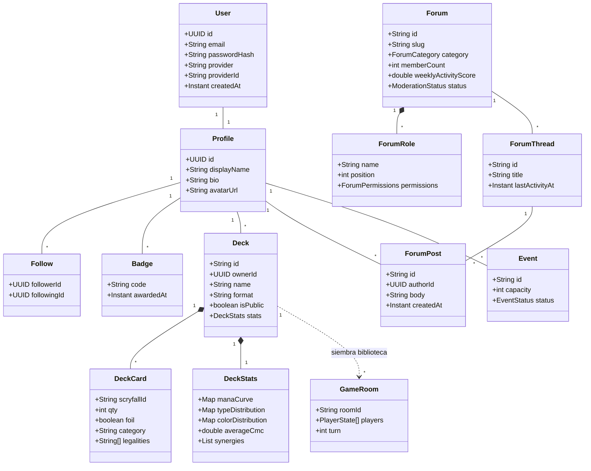
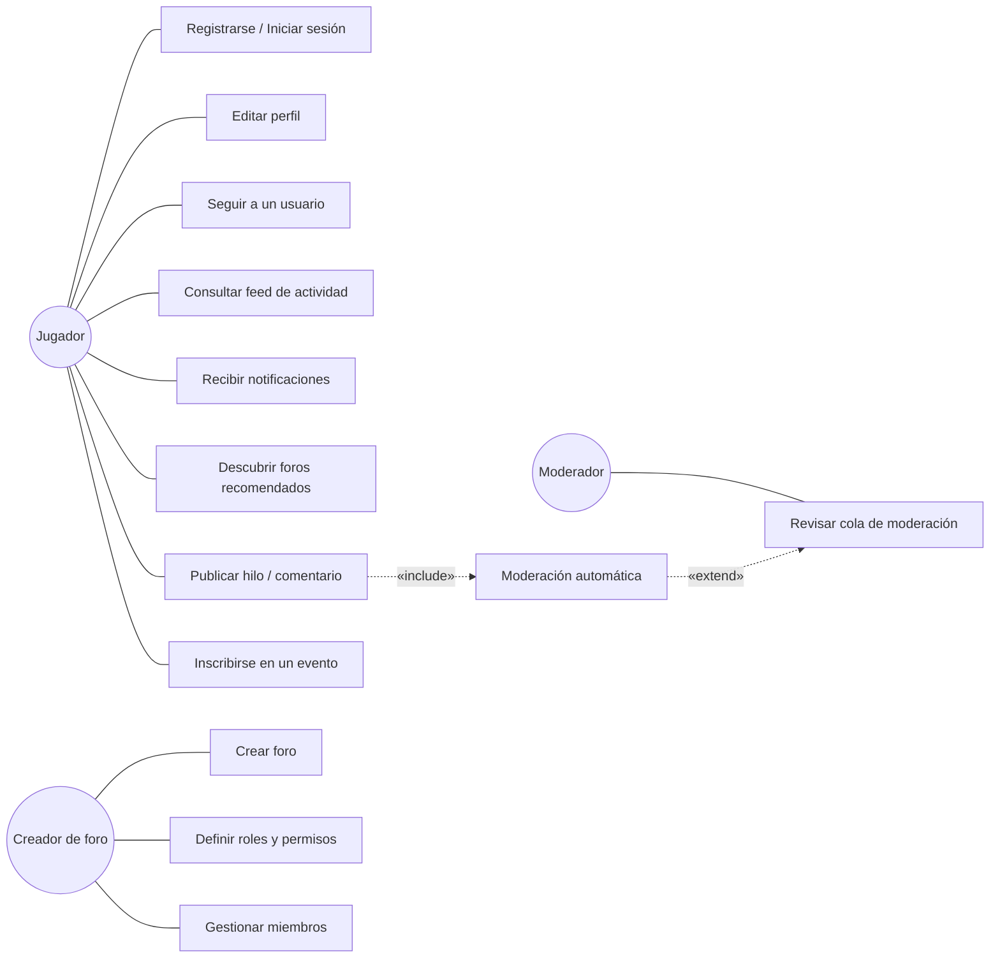
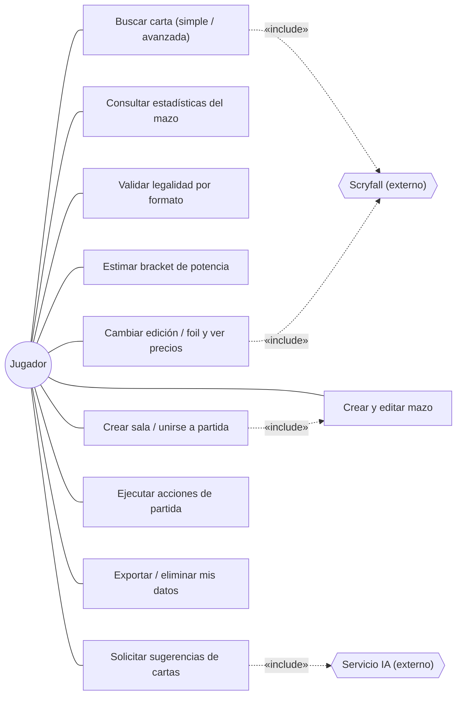
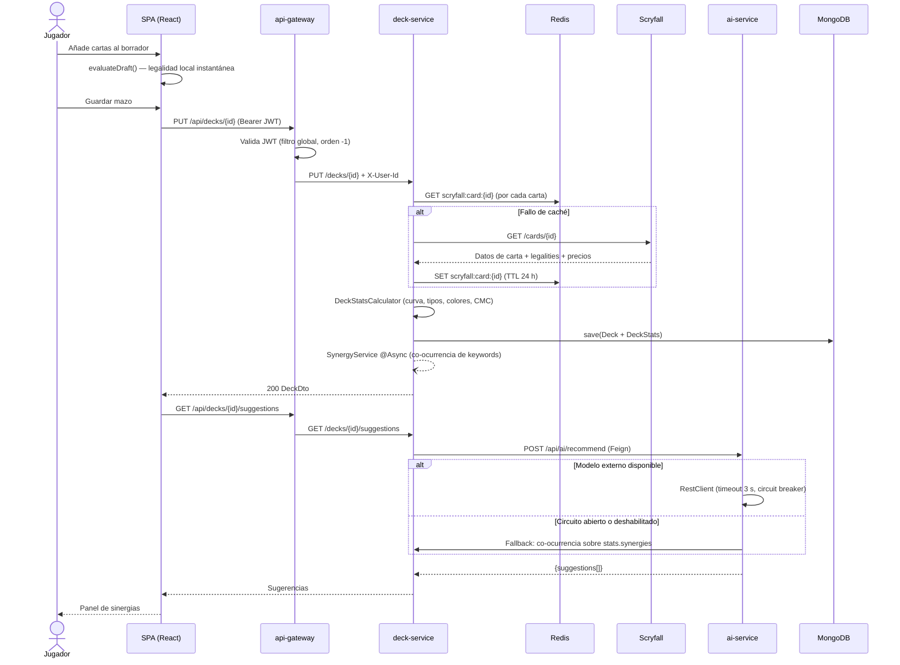
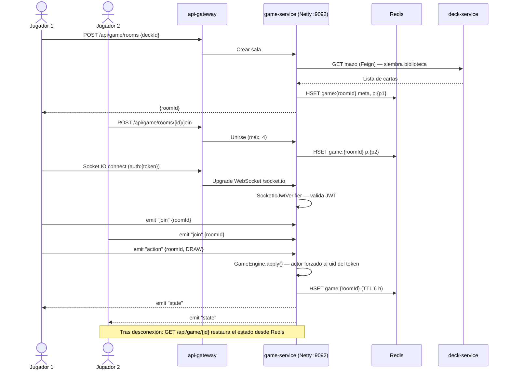

# Capítulo 4 — Desarrollo práctico

> **Estado del documento:** BORRADOR PARCIAL (v0.1).
> Contiene la estructura completa del capítulo, la argumentación de diseño y todos los
> datos verificables extraídos del repositorio. Los bloques marcados como
> `[AMPLIAR]` requieren desarrollo redaccional posterior; los marcados como
> `[PENDIENTE-DATO]` requieren ejecutar una actividad real (sesiones con usuarios,
> pruebas de carga, capturas) antes de poder cerrarse.
> Fuentes de verdad usadas: `plan_implementacion_mtg.md`, `Fase_modulo_foro.md`,
> `backend/pom-parent.xml`, `backend/docker-compose.yml`, `package.json`,
> `.github/workflows/ci.yml`, `docs/evaluacion-usabilidad.md`, `GUIA_PRUEBAS.md`
> e historial Git (29 commits, 2026-01-26 → 2026-07-07).

---

## ⚠️ Nota previa de coherencia documental (resolver antes de redactar la versión final)

`TFM_SPEC.md` declara en sus metadatos un stack **Node.js + Express + Socket.io** y
orquestación con **Kubernetes**, y afirma que los Capítulos 1 y 2 ya están redactados
sobre esa base. **El sistema realmente construido no usa ese stack.** La implementación
verificada en el repositorio es:

| Aspecto | Declarado en `TFM_SPEC.md` (Cap. 1–2) | Implementado realmente |
|---|---|---|
| Backend | Node.js + Express | **Java 17 + Spring Boot 3.3.6 + Spring Cloud 2023.0.5** |
| Tiempo real | Socket.io (servidor Node) | **netty-socketio 2.0.9** (protocolo Socket.IO sobre JVM) + **SSE** para notificaciones |
| Orquestación | Docker + Kubernetes | **Docker Compose** (5 ficheros de composición y perfiles); **sin Kubernetes** |
| Descubrimiento/routing | No especificado | **Netflix Eureka + Spring Cloud Gateway** |

**Decisión requerida del autor (una de las dos):**

1. **(Recomendada)** Actualizar los Capítulos 1–3 al stack real y justificar el cambio de
   tecnología como una decisión de diseño documentada (es defendible: ver §4.1.4). El
   protocolo Socket.IO *sí* se conserva, solo cambia la implementación del servidor.
2. Reescribir el sistema en Node.js — inviable a estas alturas del proyecto.

Igualmente, el objetivo específico **OE7** de `TFM_SPEC.md` menciona Kubernetes. Debe
reformularse a "desplegar mediante contenedores Docker y CI/CD con GitHub Actions", o
bien Kubernetes pasa a §5.2 Trabajo futuro. Todo este capítulo se redacta sobre el
**sistema real**.

---

## 4.1. Identificación de requisitos

### 4.1.1. Identificación del problema

`[AMPLIAR — enlazar explícitamente con la Tabla 1 comparativa del Cap. 2]`

El ecosistema digital de *Magic: The Gathering* (MTG) está **funcionalmente
fragmentado**: el jugador que quiere construir, analizar, discutir y probar un mazo debe
recorrer cuatro o cinco plataformas heterogéneas, sin identidad ni datos compartidos
entre ellas. De forma sintética, las carencias detectadas en el análisis del estado del
arte y que este trabajo pretende cubrir son:

- **P1 — Fragmentación funcional.** La construcción de mazos (Archidekt, Moxfield), la
  consulta de datos de carta (Scryfall), la discusión comunitaria (Reddit, Discord) y la
  prueba de la baraja (Cockatrice, MTG Arena) viven en productos distintos y
  desconectados. No existe un perfil único que agregue la actividad del jugador.
- **P2 — Componente social débil o inexistente.** Las herramientas de *deck-building*
  ofrecen, a lo sumo, comentarios; carecen de grafo social (seguidores), de feed de
  actividad, de foros con moderación propia y de organización de eventos.
- **P3 — Barrera de entrada por complejidad de reglas.** La validación de legalidad por
  formato (tamaño de mazo, *singleton*, identidad de color, listas de baneos, rareza en
  Pauper) y la estimación de nivel de potencia son conocimiento tácito difícil de
  adquirir para el jugador iniciado.
- **P4 — Desatención al público hispanohablante.** Las plataformas de referencia están
  casi exclusivamente en inglés, tanto en interfaz como en comunidad.
- **P5 — Recomendación poco accesible.** Las sugerencias de cartas dependen de sitios
  externos (EDHREC, recommander.cards) no integrados en el flujo de construcción.

### 4.1.2. Contexto habitual de uso

`[AMPLIAR]`

El sistema no se desarrolla para una empresa o institución cliente, sino como
**plataforma abierta orientada a la comunidad**, lo que condiciona los requisitos:

- **Usuario tipo:** jugador de MTG hispanohablante, mayor de edad, con nivel de juego
  entre *casual* y *competitivo*, familiarizado con herramientas web pero no
  necesariamente con terminología técnica.
- **Contexto de uso:** doméstico y móvil-ocasional; sesiones largas de construcción de
  mazo en escritorio y consultas breves de carta o foro desde el móvil. Esto justifica el
  requisito de diseño responsive y la carga diferida de recursos pesados.
- **Formato dominante:** Commander/EDH (100 cartas, *singleton*, identidad de color),
  que es el formato más jugado en mesa y el que más se beneficia de asistencia a la
  construcción. Se soportan además Standard, Pioneer, Modern, Legacy, Vintage y Pauper.
- **Restricción legal de contexto:** los datos de carta son propiedad de Wizards of the
  Coast; el sistema opera **solo en lectura** contra la API pública de Scryfall y se
  encuadra en la *Fan Content Policy*. No se replica el motor de juego oficial.

### 4.1.3. Proceso de elicitación de requisitos

`[AMPLIAR + PENDIENTE-DATO]`

La elicitación se apoyó en tres fuentes, con distinto grado de formalidad:

| Técnica | Descripción | Estado |
|---|---|---|
| **Análisis competitivo de sistemas existentes** | Estudio funcional de Archidekt, Moxfield, Scryfall, EDHREC, TappedOut y Cockatrice; extracción de funcionalidades presentes/ausentes y de convenciones de interacción ya interiorizadas por el usuario (vistas *stacks/grid/text/table*, menú contextual de carta, panel de legalidad). Documentado en la Tabla 1 (Cap. 2). | **Realizado** |
| **Conocimiento de dominio del autor** | El autor es jugador activo del formato Commander, lo que permitió redactar los requisitos de reglas (RF10–RF12) y validar el modelo de datos de mazo sin intermediarios. | **Realizado** |
| **Consulta a usuarios expertos de la comunidad** | Sesiones con jugadores reclutados en comunidades hispanohablantes de Discord/Reddit para priorizar funcionalidades y validar el prototipo. Protocolo definido en `docs/evaluacion-usabilidad.md`. | **PENDIENTE-DATO — no ejecutado** |

> **PENDIENTE-DATO (crítico para la rúbrica).** `TFM_SPEC.md` (SEC-02) exige documentar
> *cómo* se obtuvieron los requisitos, y la rúbrica penaliza su ausencia. Actualmente
> **no se ha realizado ninguna entrevista, encuesta ni sesión con usuarios reales**. Hay
> dos vías de cierre:
> **(a)** ejecutar una encuesta breve (10–15 preguntas, Google Forms) en comunidades de
> Discord/Reddit MTG en español, n ≥ 15, y una ronda de 3–5 entrevistas
> semiestructuradas con jugadores expertos; o
> **(b)** declarar honestamente que la elicitación fue **analítica** (benchmarking +
> conocimiento de dominio) y que la validación con usuarios se traslada íntegramente
> a §4.3. La opción (a) es claramente superior de cara a la evaluación académica.
>
> Datos demográficos a recoger en cualquiera de los dos casos: rango de edad, años de
> experiencia en MTG, formatos habituales, herramientas que ya usa, nivel de
> autoconfianza técnica (1–5).

### 4.1.4. Tecnologías empleadas y justificación

`[AMPLIAR — añadir cita bibliográfica APA por tecnología: Newman para microservicios, Richardson para patrones, documentación oficial de Spring/React]`

#### a) Backend — Java 17 + Spring Boot 3.3.6 + Spring Cloud 2023.0.5

**Descripción.** Diez módulos Maven independientes bajo un POM padre
(`backend/pom-parent.xml`), cada uno un servicio Spring Boot autónomo con su propio
ciclo de vida, puerto y almacén de datos.

**Justificación.** (i) Spring Cloud aporta *de serie* las piezas transversales de una
arquitectura de microservicios —descubrimiento (Eureka), *gateway* con filtros globales,
cliente declarativo entre servicios (OpenFeign), *circuit breaker* (Resilience4j)—, lo
que evita implementarlas manualmente y permite centrar el esfuerzo en el dominio;
(ii) el tipado estático y el ecosistema de pruebas de la JVM reducen el riesgo en un
sistema con diez despliegues; (iii) Spring Data ofrece abstracción homogénea sobre
PostgreSQL, MongoDB y Redis, lo que hace viable la persistencia políglota (§4.2.4).

#### b) Frontend — React 19 + TypeScript + Vite 7 + Redux Toolkit

**Descripción.** SPA con enrutado en cliente (`react-router-dom` 6), estado global en
Redux Toolkit (*slices* `auth`, `deck`, `forum`, `game`, `notifications`, `profile`),
UI sobre React-Bootstrap 5.3 con capa de tema propia, gráficos con Recharts,
arrastrar-y-soltar con react-dnd, animación con Framer Motion, escena 3D de la portada
con three.js + React Three Fiber, e i18n con i18next (ES/EN).

**Justificación.** React es el estándar de facto con mayor disponibilidad de
bibliotecas de dominio; TypeScript aporta seguridad de tipos en la frontera con la API;
Vite reduce el tiempo de compilación e integra división de *bundles* (`manualChunks`),
necesaria porque three.js pesa ~286 KB gzip y solo debe cargarse en la portada;
Redux Toolkit se eligió sobre el Zustand preexistente por la necesidad de estado
compartido complejo (borrador de mazo, sesión de partida, flujos de notificación).

#### c) Persistencia políglota — PostgreSQL 16, MongoDB 7, Redis 7

| Almacén | Servicios | Motivo |
|---|---|---|
| **PostgreSQL 16** | `auth-service`, `user-service` | Datos con integridad referencial fuerte y baja variabilidad: credenciales, perfiles, seguidores, insignias. Transaccionalidad ACID exigible en el registro y en el grafo social. |
| **MongoDB 7** | `deck-service`, `forum-service` | Documentos anidados de esquema variable: un mazo embebe sus cartas y su bloque de estadísticas; un foro embebe roles, permisos y ajustes. Evita el *join* costoso y el esquema rígido. |
| **Redis 7** | `deck-service` (caché), `game-service` (estado), `notification-service` (Pub/Sub), `api-gateway` (rate limiting) | Estructuras efímeras con TTL: caché de Scryfall (24 h), estado de partida en *hash* `game:{roomId}` con TTL de 6 h, canal Pub/Sub de notificaciones y cubos de limitación de tasa. |

#### d) Comunicación en tiempo real — Socket.IO (netty-socketio) y SSE

Se emplean **dos** mecanismos distintos según la naturaleza del flujo:

- **Socket.IO bidireccional** para el simulador de partida (`game-service`), donde el
  cliente emite acciones (`join`, `action`) y el servidor difunde el estado (`state`) a
  todos los jugadores de la sala. Implementado con **netty-socketio 2.0.9** sobre un
  servidor Netty independiente. *Nota de proceso:* inicialmente se implementó con
  **STOMP sobre WebSocket** y se migró a Socket.IO porque el *proxy* inverso de
  producción solo admite el protocolo Socket.IO (§4.2.3, hito H7).
- **Server-Sent Events (SSE)** para notificaciones y flujo de foros
  (`notification-service`, `forum-service`), donde el flujo es unidireccional
  servidor→cliente. Se descartó `EventSource` nativo porque no permite cabecera
  `Authorization`; se usa `fetch` con lectura de *stream*.

#### e) Integración externa — Scryfall API

Única fuente de datos de carta (nombre, coste, texto, imágenes, precios, legalidades por
formato). Se accede **solo en lectura** a través de `search-service` y `deck-service`,
nunca desde el navegador, para poder cachear en Redis, respetar el límite de tasa de
Scryfall y no exponer al cliente la dependencia externa.

#### f) DevOps — Docker Compose, GitHub Actions, nginx, Firebase Hosting

- **Docker Compose** con **perfiles** (`fase2`, `fase3`, `fase4`, `legacy`) permite
  arrancar solo el subconjunto de servicios necesario, requisito práctico dado que el
  sistema completo son 10 JVM + 3 bases de datos. Composiciones adicionales para
  producción (`docker-compose.prod.yml`), despliegue con TLS (`.deploy.yml` + Caddy) y
  demostración por túnel (`.share.yml` + cloudflared).
- **GitHub Actions** (`.github/workflows/ci.yml`): compilación y empaquetado de los 11
  módulos en cada *push* y *pull request* a `main`, con servicio PostgreSQL efímero y
  publicación de los JAR como artefactos.
- **nginx** como servidor del SPA y *proxy* de mismo origen hacia el *gateway*, lo que
  elimina el problema de CORS y permite publicar todo bajo una única URL.

> `[AMPLIAR]` Añadir tabla resumen versión-a-versión de todas las dependencias
> (extraíble de `package.json` y de los POM) como anexo, y una figura del *stack*.

### 4.1.5. Requisitos funcionales

Numeración trazable: cada RF referencia el servicio y el endpoint/componente que lo
implementa, de modo que §4.3 pueda evaluarlo y el Cap. 5 concluir sobre él.

#### Módulo Identidad y Social

| ID | Requisito | Implementado en |
|---|---|---|
| RF01 | El sistema debe permitir el registro de un usuario mediante correo y contraseña, y su autenticación posterior, emitiendo un token JWT de acceso y un *refresh token* con rotación. | `auth-service` · `POST /api/auth/register`, `/login`, `/refresh` |
| RF02 | El sistema debe permitir la autenticación federada con Google (OpenID Connect), enlazando por correo con una cuenta existente si procede. | `auth-service` · `POST /api/auth/google` |
| RF03 | El sistema debe permitir consultar y editar el perfil público de un usuario (alias, biografía, avatar) y aprovisionarlo de forma diferida en el primer acceso. | `user-service` · `GET/PUT /api/users/{id}`, `/me` |
| RF04 | El sistema debe permitir seguir y dejar de seguir a otros usuarios, y consultar las listas de seguidores y seguidos. | `user-service` · `POST/DELETE/GET /api/users/follow`, `/followers`, `/following` |
| RF05 | El sistema debe generar un feed de actividad con las publicaciones de los usuarios seguidos. | `user-service` · `GET /api/users/feed` |
| RF06 | El sistema debe otorgar insignias automáticas al alcanzar hitos de seguidores y publicar una clasificación de usuarios. | `user-service` · `GET /api/users/badges`, `/leaderboard` |
| RF07 | El sistema debe notificar en tiempo real al usuario los eventos que le conciernen (nuevo seguidor, respuesta, nuevo evento) mediante un flujo persistente, con recuperación de las notificaciones recientes tras reconectar. | `notification-service` · `GET /api/notifications/stream` (SSE) + lista en Redis |

#### Módulo Foros y Eventos

| ID | Requisito | Implementado en |
|---|---|---|
| RF08 | El sistema debe permitir crear foros temáticos con categoría, portada, etiquetas y ajustes de privacidad, organizados en un modelo de tres niveles (Foro → Hilo → Publicación). | `forum-service` · `ForumController` |
| RF09 | El sistema debe implementar un sistema de roles y permisos por foro (tipo Discord), con jerarquía y rol por defecto al unirse. | `forum-service` · `ForumAdminController`, `RoleService`, `MembershipService` |
| RF10 | El sistema debe moderar automáticamente el contenido publicado mediante detección multilingüe, encolando para revisión humana el contenido dudoso. | `forum-service` · `ModerationController`, `ModerationService`, `ModerationQueueService` |
| RF11 | El sistema debe recomendar foros al usuario en función de una puntuación de actividad semanal. | `forum-service` · `ForumDiscoveryService`, `ActivityScoreService` |
| RF12 | El sistema debe permitir publicar hilos, publicaciones y comentarios con paginación por cursor, y difundir la actividad a los seguidores del autor. | `forum-service` · `PostController`, `CommentController`, `ForumStreamController` |
| RF13 | El sistema debe permitir crear eventos comunitarios con aforo e inscribirse en ellos, con estados OPEN/FULL/CLOSED. | `forum-service` · `POST /api/events`, `/{id}/register` |

#### Módulo Constructor de mazos

| ID | Requisito | Implementado en |
|---|---|---|
| RF14 | El sistema debe permitir buscar cartas en el catálogo de Scryfall, tanto con búsqueda simple como con un constructor visual de consulta avanzada (color, tipo, rareza, CMC, set, texto de oracle, legalidad). | `search-service` · `GET /api/scryfall/search`; `AdvancedSearchPage.tsx` |
| RF15 | El sistema debe permitir el CRUD completo de mazos, su visibilidad pública/privada y su búsqueda. | `deck-service` · `/api/decks` (CRUD), `/me`, `/public`, `/search` |
| RF16 | El sistema debe calcular automáticamente y presentar las estadísticas del mazo: curva de maná, distribución de tipos, distribución de colores y CMC medio. | `deck-service` · `DeckStatsCalculator`; `ManaChart.tsx` |
| RF17 | El sistema debe validar la legalidad del mazo respecto al formato seleccionado (tamaño, copias, *singleton*, baneos, rareza, identidad de color del comandante), de forma **consultiva y no bloqueante**. | `deck-service` · `DeckLegalityService`, `GET /api/decks/{id}/legality`; espejo cliente en `src/data/formats.ts` |
| RF18 | El sistema debe ofrecer cuatro vistas del mazo (pilas, cuadrícula, texto y tabla) con agrupación y ordenación configurables, y recategorización mediante arrastrar y soltar. | `DeckViews.tsx`, `DeckToolbar.tsx` |
| RF19 | El sistema debe permitir gestionar la edición concreta (*printing*) y el acabado foil de cada carta, mostrando precios de TCGPlayer (USD) y Cardmarket (EUR) por carta y por sección. | `deck-service` · `GET /api/decks/cards/printings`; `CardContextMenu.tsx` |
| RF20 | El sistema debe estimar el *bracket* de potencia del mazo (escala 1–5 de Wizards of the Coast) a partir de heurísticas sobre las cartas incluidas. | `src/services/bracket.ts`, `BracketPanel.tsx` |
| RF21 | El sistema debe representar todos los costes de maná mediante los símbolos oficiales del juego, nunca como texto. | `ManaCost.tsx` / `ManaSymbol` |

#### Módulo Simulador

| ID | Requisito | Implementado en |
|---|---|---|
| RF22 | El sistema debe permitir crear una sala de partida y unirse a ella (máximo 4 jugadores), sembrando la biblioteca desde un mazo del usuario. | `game-service` · `POST /api/game/rooms`, `/{id}/join` |
| RF23 | El sistema debe ejecutar las acciones básicas de partida (barajar, robar, jugar carta, girar, mulligan de Londres, fin de turno) y difundir el estado resultante a todos los jugadores de la sala en tiempo real. | `game-service` · `GameEngine`, `GameSocketHandler` |
| RF24 | El sistema debe permitir reanudar una partida tras una desconexión, recuperando el estado persistido. | `game-service` · `GET /api/game/{id}`, `RedisGameStateStore` |

#### Módulo Recomendación / IA

| ID | Requisito | Implementado en |
|---|---|---|
| RF25 | El sistema debe sugerir cartas para un mazo en construcción a partir de un modelo de recomendación, degradando a un algoritmo propio de co-ocurrencia si el servicio externo no está disponible. | `ai-service` · `POST /api/ai/recommend`; `deck-service` · `GET /api/decks/{id}/suggestions`; `SynergyPanel.tsx` |
| RF26 | El sistema debe mostrar, en la ficha de una carta legendaria, recomendaciones de comandante procedentes de un servicio externo especializado. | `search-service` · `GET /api/scryfall/recommander` |

#### Módulo Cumplimiento y Cuenta

| ID | Requisito | Implementado en |
|---|---|---|
| RF27 | El sistema debe permitir al usuario exportar todos sus datos personales en formato legible por máquina (derecho de portabilidad, art. 20 RGPD). | `user-service` · `GET /api/users/me/export` |
| RF28 | El sistema debe permitir al usuario eliminar su cuenta, propagando el borrado a todos los servicios que almacenan datos suyos (derecho de supresión, art. 17 RGPD). | `user-service` · `DELETE /api/users/me` + evento `USER_DELETED` por Redis Pub/Sub consumido por `deck-service`, `forum-service` y `notification-service` |
| RF29 | El sistema debe ofrecer la interfaz completa en español e inglés, con conmutador de idioma persistente. | i18next · `src/i18n/` |

**Total: 29 requisitos funcionales** (mínimo exigido por `TFM_SPEC.md`: 15). ✔

### 4.1.6. Requisitos no funcionales

| ID | Categoría | Requisito y métrica | Verificación |
|---|---|---|---|
| RNF01 | Rendimiento | El percentil 95 del tiempo de respuesta del API Gateway debe ser inferior a **500 ms** bajo una carga sostenida de **100 peticiones/s**. | `docs/load-test/gateway-load-test.js` (k6) — **PENDIENTE-DATO: no ejecutado** |
| RNF02 | Rendimiento | La puntuación *Performance* de Lighthouse en la portada debe ser **> 85**. | `npx lighthouse` — **PENDIENTE-DATO: no ejecutado** |
| RNF03 | Rendimiento | El *bundle* inicial del cliente no debe superar los **500 KB**; los recursos pesados (three.js, gráficos) deben cargarse de forma diferida. | Verificado: `manualChunks` en `vite.config.ts` redujo el *bundle* principal de ~1 MB a **402 KB**; three.js (~286 KB gzip) se carga vía `React.lazy`. ✔ |
| RNF04 | Rendimiento | Las consultas repetidas al catálogo externo deben servirse desde caché con TTL de **24 h**, evitando exceder el límite de tasa de Scryfall. | Verificado: `ScryfallClient` + `StringRedisTemplate`, claves `scryfall:card:{id}` / `scryfall:search:{q}:{page}`. ✔ |
| RNF05 | Disponibilidad y resiliencia | El fallo de un servicio no debe propagarse: las llamadas a servicios externos e internos deben protegerse con *circuit breaker* y *timeout*, con respuesta degradada. | Verificado: Resilience4j (`aiExternal`), `FallbackController` en el *gateway*, `timelimiter` a 12 s, degradación de `ai-service` a algoritmo local. ✔ |
| RNF06 | Seguridad | Toda ruta no declarada explícitamente como pública debe exigir un JWT válido, validado en el *gateway* antes de alcanzar cualquier servicio de dominio. | Verificado: filtro global `JwtGlobalFilter` de orden −1 + lista `PUBLIC_PATHS`. ✔ |
| RNF07 | Seguridad | Las contraseñas deben almacenarse cifradas con función de derivación lenta (BCrypt); nunca en claro ni con hash reversible. | Verificado: `BCryptPasswordEncoder` en `auth-service`. ✔ |
| RNF08 | Seguridad | El sistema debe mitigar los riesgos aplicables de OWASP Top 10: control de acceso roto (A01), fallos criptográficos (A02), inyección (A03) y errores de configuración de seguridad (A05). | Parcial: JWT en *gateway* (A01), BCrypt + TLS (A02), consultas parametrizadas vía Spring Data (A03), cabeceras `X-Frame-Options` / `X-Content-Type-Options` / `Referrer-Policy` (A05). **`[AMPLIAR]`: falta análisis SAST/dependencias documentado.** |
| RNF09 | Seguridad | El sistema debe limitar la tasa de peticiones por origen a **20 req/s** con ráfaga de **40**, para mitigar abuso y denegación de servicio. | Verificado: `RequestRateLimiter` + `ipKeyResolver` en el *gateway*. ⚠ *Limitación conocida*: tras el proxy nginx todas las peticiones comparten cubo (se resuelve por IP de contenedor, no por `X-Forwarded-For`). |
| RNF10 | Privacidad / RGPD | El sistema debe soportar los derechos de portabilidad (art. 20) y supresión (art. 17), con borrado efectivo y propagado en todos los almacenes en un plazo máximo de una operación asíncrona. | Verificado: RF27/RF28 + suscriptores `USER_DELETED`. ✔ |
| RNF11 | Trazabilidad | Los eventos de seguridad relevantes (login correcto, login fallido con correo e IP) deben registrarse en un *logger* de auditoría diferenciado. | Verificado: *logger* `AUDIT` en `auth-service`. ✔ |
| RNF12 | Usabilidad | La puntuación media del cuestionario **SUS** con usuarios reales debe ser **≥ 70**. | `docs/evaluacion-usabilidad.md` — **PENDIENTE-DATO: sesiones no ejecutadas** |
| RNF13 | Accesibilidad | La interfaz debe respetar `prefers-reduced-motion` desactivando las animaciones no esenciales, y mantener contraste suficiente en el tema oscuro. | Verificado parcialmente: `useReducedMotion` en portada y escena 3D; corrección de variantes de bajo contraste. **`[AMPLIAR]`: falta auditoría WCAG 2.1 AA formal.** |
| RNF14 | Internacionalización | La interfaz debe estar disponible íntegramente en español e inglés, sin cadenas incrustadas en el código. | Parcial: `nav.*`, `landing.*`, `builder.*`, `commanders.*`, `advSearch.*` traducidas; **quedan cadenas sin externalizar en el simulador y la página de cuenta**. |
| RNF15 | Mantenibilidad | Todo *push* a `main` debe compilar y empaquetar los 11 módulos automáticamente; ningún módulo puede romper la compilación del conjunto. | Verificado: `.github/workflows/ci.yml`. ⚠ *Limitación*: el paso usa `-DskipTests`; **las pruebas no se ejecutan en CI**. |
| RNF16 | Portabilidad | El sistema debe desplegarse sin cambios de código sobre arquitecturas x86-64 y ARM64. | Verificado analíticamente: todas las imágenes base son multi-arquitectura y no hay `--platform` fijado (`DEPLOY_ORACLE.md`). |

**Total: 16 requisitos no funcionales cuantificados** (mínimo exigido: 5). ✔

### 4.1.7. Restricciones

- **R1 — Datos de carta.** Únicamente lectura desde la API pública de Scryfall; no se
  almacena una copia completa del catálogo ni se redistribuyen las imágenes.
- **R2 — Propiedad intelectual.** *Magic: The Gathering* y "Planeswalker" son marcas de
  Wizards of the Coast. El proyecto se ampara en la *Fan Content Policy*, lo que limita
  la monetización y obliga a evitar confusión con productos oficiales.
- **R3 — Alcance del simulador.** Se implementan las acciones básicas de partida
  (barajar, robar, jugar, girar, mulligan, fin de turno) **sin pila de hechizos ni motor
  de reglas**: no se pretende replicar MTG Arena ni resolver interacciones complejas.
- **R4 — Naturaleza de prototipo.** El sistema es un prototipo académico funcional, no
  un producto comercial: sin SLA, sin soporte y con datos de demostración.
- **R5 — Recursos de infraestructura.** Desarrollo y despliegue con presupuesto cero o
  mínimo, sobre un único servidor. Esta restricción excluyó Kubernetes y los servicios
  gestionados de nube, y motivó el estudio comparativo de `docs/hosting-costs.md`.
- **R6 — Equipo unipersonal.** El desarrollo lo realiza una sola persona a tiempo
  parcial, lo que condiciona la metodología (§4.1.8) y la profundidad de las pruebas.

### 4.1.8. Organización del desarrollo, participantes e instrumentos de seguimiento

`[AMPLIAR]`

#### a) Organización y metodología

El desarrollo se organizó en **cinco fases incrementales** más dos ciclos de refuerzo
posteriores, cada una con criterios de verificación explícitos definidos *a priori* en
`plan_implementacion_mtg.md` y, para el módulo de foros, en `Fase_modulo_foro.md`. Cada
fase se corresponde con un **incremento desplegable** (equivalente a un *sprint* de
Scrum adaptado a un equipo unipersonal): se define el alcance, se implementa, se prueba
y se integra en `main` antes de abrir la siguiente.

Al tratarse de un equipo de una persona, se adoptó **Scrum reducido**: se conservan el
*product backlog* (los RF de §4.1.5), la planificación por incremento, la definición de
"terminado" (compila + pruebas verdes + verificado en Docker) y la retrospectiva
implícita al cierre de fase; se prescinde de las ceremonias que requieren varios roles
(*daily*, *sprint review* con *stakeholders*).

#### b) Participantes

| Rol | Persona | Dedicación |
|---|---|---|
| Autor / desarrollador / arquitecto | Breogán González Saborido | Tiempo parcial, ene–jul 2026 |
| Directora del TFM | Laura García Borgoñón | Supervisión y revisión |
| Usuarios evaluadores | `[PENDIENTE-DATO]` — a reclutar (n ≥ 5) | Sesiones de §4.3 |

> `[PENDIENTE-DATO]` Datos demográficos de los evaluadores: edad, género, años de
> experiencia en MTG, formatos habituales, herramientas previas, nivel técnico
> autopercibido. Sin ellos, §4.3 no cumple el criterio de validación de `TFM_SPEC.md`.

#### c) Instrumentos de seguimiento y evaluación del proceso

| Instrumento | Uso | Evidencia |
|---|---|---|
| **Git + GitHub** | Control de versiones y trazabilidad. 29 *commits*, ramas de característica (`feat/fase1-2`, `feature/reconfigure-ports`) integradas mediante *pull request*. | Historial del repositorio |
| **GitHub Actions** | Integración continua: compilación y empaquetado de los 11 módulos en cada *push*/PR a `main`, con PostgreSQL efímero y publicación de artefactos. | `.github/workflows/ci.yml` |
| **Pruebas unitarias JUnit** | 19 clases de prueba en 5 servicios, cubriendo la lógica de dominio crítica: motor de partida, cálculo de estadísticas, legalidad, sinergias, moderación, roles, membresías, paginación por cursor, verificación de JWT en el *socket*. | `backend/*/src/test/` |
| **Pruebas unitarias Vitest** | 6 suites en el cliente sobre lógica pura: validador de formatos, estimación de *bracket*, agrupación de vistas, parseo de importación, utilidades estadísticas, *slice* de foros. | `src/**/*.test.ts` |
| **Documentación viva de API** | Springdoc OpenAPI 2.6.0 en los 8 servicios de dominio (`/v3/api-docs`, `/swagger-ui.html`), usada para validar contratos entre servicios. | POM padre + configuración por servicio |
| **Guía de pruebas manuales** | Protocolo de verificación funcional extremo a extremo por fases, ejecutado antes de cada integración a `main`. | `GUIA_PRUEBAS.md` |
| **Actuator / Eureka** | Comprobación operativa: registro de los 9 servicios, *health checks*, verificación de despliegue tras cada reconstrucción de imágenes. | `/actuator/health`, consola Eureka |
| **Protocolo de evaluación de usabilidad** | Instrumento definido (tareas, *think-aloud*, cuestionario SUS, criterio de aceptación) pendiente de aplicación. | `docs/evaluacion-usabilidad.md` |

> ⚠ **Limitación honesta a declarar en la memoria:** el flujo de CI ejecuta
> `mvn -DskipTests`, por lo que **las pruebas existen pero no se ejecutan
> automáticamente**. Es una mejora de bajo coste (eliminar el *flag* y añadir un paso
> `mvn test`) que conviene aplicar antes de la entrega para poder afirmar sin matices
> que el proceso contaba con verificación continua.

---

## 4.2. Descripción del sistema software desarrollado

### 4.2.1. Visión general

`[AMPLIAR]`

**Planeswalkers Tower** es una plataforma web que integra en un único producto los
cuatro dominios hoy fragmentados: red social, constructor de mazos con asistencia de
reglas, foros/eventos comunitarios y simulador de partidas. Se estructura como un
**sistema de microservicios** de diez servicios backend más un cliente SPA, con
persistencia políglota y una única puerta de entrada.

### 4.2.2. Arquitectura del sistema

#### Figura 4.1 — Diagrama de componentes

*Figura 4.1. Arquitectura de componentes del sistema. Las líneas continuas representan
llamadas síncronas; las discontinuas, comunicación asíncrona, de descubrimiento o
inter-servicio mediante OpenFeign.*

#### Decisiones arquitectónicas y su justificación

| # | Decisión | Alternativa descartada | Justificación |
|---|---|---|---|
| DA1 | Microservicios con Eureka + Gateway | Monolito modular | El proyecto partía de un monolito (*commit* `9afbf2e`, "Refactor for microservice architecture"). La descomposición permite escalar y desplegar por dominio y es un objetivo declarado del TFM. **Coste asumido:** 10 JVM y mayor complejidad operativa. |
| DA2 | Validación de JWT centralizada en el *gateway* (filtro de orden −1), propagando la identidad a los servicios en la cabecera `X-User-Id` | Validar el JWT en cada servicio | Elimina la duplicación de la configuración de seguridad en 8 servicios y reduce la superficie de error. `deck-service` llegó a eliminar Spring Security por completo. **Riesgo asumido:** los servicios confían en la cabecera, por lo que **no deben ser accesibles fuera de la red interna**. |
| DA3 | Persistencia políglota (PostgreSQL / MongoDB / Redis) | Una única base de datos relacional | Ajustar el almacén a la forma del dato (§4.1.4c). Motivó la reescritura de `deck-service` de JPA/PostgreSQL a MongoDB en la Fase 3. |
| DA4 | Base de datos por servicio | Base compartida | Evita el acoplamiento por esquema. Actualmente `auth-service` y `user-service` comparten instancia PostgreSQL — **deuda técnica reconocida**, separable sin cambio de código. |
| DA5 | Validación de legalidad **duplicada** en cliente y servidor | Solo en servidor | El cliente (`src/data/formats.ts`) da retroalimentación instantánea mientras se construye; el servidor (`DeckLegalityService`) es la autoridad. **Coste asumido:** dos implementaciones de las mismas reglas que deben mantenerse sincronizadas. |
| DA6 | Legalidad **consultiva, no bloqueante** | Impedir guardar mazos ilegales | Los jugadores construyen borradores y prueban listas fuera de formato; bloquear sería hostil. Se informa, no se impide. |
| DA7 | Listas de baneos leídas del campo `legalities` de Scryfall | Lista curada propia | Evita el mantenimiento manual tras cada actualización de baneos de Wizards. |
| DA8 | Cliente SPA servido en el **mismo origen** que la API mediante *proxy* nginx | Orígenes separados con CORS | Elimina CORS, permite publicar el sistema completo bajo una URL (necesario para túneles de demostración) y no exige recompilar el cliente por cada dominio. |
| DA9 | SSE para notificaciones, Socket.IO solo para la partida | WebSocket para todo | SSE es más simple y suficiente para flujos unidireccionales; el coste de la conexión bidireccional se paga solo donde aporta. |

### 4.2.3. Fases, hitos y evolución del desarrollo

`[AMPLIAR — cruzar con los OE del Cap. 3 y añadir esfuerzo estimado por fase]`

#### Tabla 4.x — Fases, entregables e hitos (fechas reales del repositorio)

| Fase | Periodo | Objetivo | Entregable / hito | Evidencia |
|---|---|---|---|---|
| **F0 — Prototipo monolítico** | 26 ene – 23 mar 2026 | Validar la integración con Scryfall y la construcción básica de mazos | Cliente React con Zustand y backend monolítico | `f2cb322`, `fd85da8` |
| **H0 — Refactor arquitectónico** | 23 mar 2026 | Descomponer el monolito | Estructura multi-módulo de microservicios | `9afbf2e` |
| **F1 — Núcleo de plataforma** | 15 jun 2026 | Descubrimiento, enrutado y autenticación | `eureka-server`, `api-gateway` con filtro JWT global, `auth-service` (registro/login/refresh), `docker-compose` base, CI en GitHub Actions. **Verificación: 11/11 módulos compilan** | `b61096b` |
| **F2 — Capa social** | 15 jun 2026 | Identidad social y tiempo real unidireccional | `user-service` (perfiles, seguidores, insignias), `foro-service` v1 (MongoDB, paginación por cursor), `notification-service` (SSE + Redis Pub/Sub), Redux Toolkit en el cliente | `7454102` |
| **F3 — Constructor de mazos** | 24 jun 2026 | Dominio central del producto | Reescritura de `deck-service` a MongoDB + caché Redis (TTL 24 h), motor de estadísticas, sinergias asíncronas, UI de construcción con arrastrar y soltar | `a8f128b` |
| **F4 — Simulador e IA** | 24 jun 2026 | Tiempo real bidireccional y recomendación | `game-service` (motor puro + estado en Redis con TTL 6 h), `ai-service` con *circuit breaker* y degradación local, `GameSimulatorPage` | `66151fc` |
| **F5 — Cumplimiento y producción** | 25 jun 2026 | Preparar para exposición pública | RGPD (exportación/supresión propagada), limitación de tasa, auditoría de login, eventos, perfil de producción, protocolo de evaluación | `c49a0e2` |
| **H1 — Integración en `main`** | 28 jun 2026 | Cierre del plan de 5 fases | *Merge* no-ff de las 5 fases + documentación (`GUIA_PRUEBAS.md`, OpenAPI en todos los servicios, división de *bundles*) | `d52d1ef`, `eddf5c6`, `247381f` |
| **F6 — Refuerzo de UX y catálogo** | 28 jun – 1 jul 2026 | Corregir carencias detectadas en la verificación manual | Sistema de diseño oscuro "Arcane obsidian", cartas de doble cara con volteo 3D, recomendaciones de recommander.cards, separación de búsquedas (comandantes / avanzada), nueva portada con paralaje y escena 3D, i18n de navegación | `b330275`, `5b124d5`, `379cab5` |
| **H2 — Despliegue en producción** | 30 jun – 1 jul 2026 | Sistema accesible públicamente | Backend tras *proxy* inverso con TLS en `torresowo.myftp.org:7777`; cliente en Firebase Hosting (`planeswalkerstower.web.app`); reconfiguración de puertos | `789c177`, `69ea7c2` |
| **H3 — Migración STOMP → Socket.IO** | 1 jul 2026 | Compatibilidad con el *proxy* de producción | `game-service` reimplementado sobre netty-socketio; ruta `/socket.io/**` en el *gateway*; cliente migrado a `socket.io-client` | (en rama de trabajo) |
| **F7 — Constructor avanzado** | 3–4 jul 2026 | Paridad funcional con las herramientas de referencia | Legalidad por formato (backend + espejo cliente), 4 vistas de mazo, menú contextual, ediciones y foil, precios duales, estimación de *bracket*, símbolos de maná oficiales | `10a3b25`, `d331ae3` |
| **F8 — Revisión del módulo de foros** | 7 jul 2026 | Modelo social de 3 niveles | Modelo Foro→Hilo→Publicación, roles y permisos por foro, membresías, moderación automática multilingüe con cola de revisión, descubrimiento por actividad semanal | `de0c29b` |

**Incidencias técnicas relevantes del proceso** (útiles para la narrativa del capítulo,
demuestran razonamiento de ingeniería y no solo resultado):

1. **Destinos STOMP con punto no enrutaban.** El plan especificaba destinos separados por
   punto; el *matcher* por defecto de Spring exige `/`. Detectado porque el manejador no
   se invocaba. Corregido cambiando la convención de destinos.
2. **`DataBufferLimitException` en ediciones de carta.** Las respuestas de Scryfall con
   `unique=prints` (p. ej. *Sol Ring*, 100+ ediciones) superan el búfer reactivo por
   defecto de 256 KB y el endpoint devolvía lista vacía. Corregido elevando
   `maxInMemorySize` a 8 MB en `ScryfallConfig`.
3. **Imágenes Docker obsoletas.** Los contenedores desplegados ejecutaban una
   configuración de puertos anterior a la del código fuente, provocando fallos de
   registro en Eureka difíciles de diagnosticar. Se estableció como norma reconstruir
   **todos** los servicios, no solo los modificados.
4. **Explosión de tipos TypeScript (TS2590).** React Three Fiber amplía el espacio de
   nombres JSX global; combinado con los tipos polimórficos de React-Bootstrap superaba
   el límite de uniones del compilador en ficheros no relacionados. Resuelto mediante
   *stubs* de tipos locales mapeados en `tsconfig.app.json`, conservando los paquetes
   reales en tiempo de ejecución.
5. **Símbolo de maná incoloro incorrecto.** El *sprite* SVG empleado es anterior a 2016 y
   no contiene el símbolo incoloro; su celda gris corresponde en realidad al símbolo de
   *nieve*. Corregido dibujando el símbolo incoloro como SVG en línea.

### 4.2.4. Modelo de datos

#### Figura 4.2 — Diagrama de entidades principales

*Figura 4.2. Entidades principales. `User` y `Profile` residen en PostgreSQL; `Deck`,
`Forum`, `ForumThread`, `ForumPost` y `Event` en MongoDB (con `DeckCard` y `DeckStats`
embebidos en el documento `Deck`); `GameRoom` es estado efímero en Redis.*

> `[AMPLIAR]` Justificar la **desnormalización deliberada**: `DeckCard` almacena una
> instantánea de los datos de la carta (nombre, coste, imagen, precios) además del
> `scryfallId`, para que el mazo se pueda renderizar sin depender de Scryfall en cada
> carga. Igualmente, `forum-service` enriquece el autor **en el momento de escritura**
> mediante Feign, evitando el problema N+1 en lectura.

### 4.2.5. Casos de uso

#### Figura 4.3 — Casos de uso (módulos Social y Foros)

#### Figura 4.4 — Casos de uso (módulos Constructor, Simulador e IA)

### 4.2.6. Flujos críticos

#### Figura 4.5 — Secuencia: guardar mazo, calcular estadísticas y obtener sugerencias

#### Figura 4.6 — Secuencia: partida multijugador en tiempo real

> `[AMPLIAR]` Añadir una tercera secuencia para el flujo RGPD de supresión de cuenta
> (`DELETE /api/users/me` → evento `USER_DELETED` por Redis Pub/Sub → borrado en
> `deck-service`, `forum-service` y `notification-service`), que ilustra la
> comunicación asíncrona dirigida por eventos.

### 4.2.7. Descripción de los módulos

`[AMPLIAR — desarrollar cada ficha a 1–2 párrafos con sus patrones de diseño]`

| Servicio | Persistencia | Patrón / decisión de diseño destacable |
|---|---|---|
| `eureka-server` | — | Registro de servicios; único punto de resolución de `lb://`. |
| `api-gateway` | Redis | *API Gateway* + *Edge authentication*. Filtro global de orden −1, lista de rutas públicas, limitación de tasa, `timelimiter` a 12 s (elevado desde 1 s por la latencia de los servicios externos), cabeceras de seguridad y `FallbackController`. |
| `auth-service` | PostgreSQL | Emisión de JWT con *refresh token* rotatorio; verificación de ID token de Google (OIDC); *logger* de auditoría; contraseña aleatoria BCrypt para cuentas federadas, de modo que el acceso por contraseña sea imposible sin romper la restricción `NOT NULL`. |
| `user-service` | PostgreSQL | Perfil aprovisionado de forma diferida usando como clave primaria el UUID de `auth-service`; insignias automáticas por hitos; publicación de notificaciones al canal Redis; endpoints RGPD que agregan datos de otros servicios vía Feign. |
| `forum-service` | MongoDB | Modelo de agregado de 3 niveles; roles y permisos embebidos; paginación por **cursor** (Base64 de `createdAt`) en lugar de *offset*, para evitar la degradación con desplazamientos grandes; enriquecimiento del autor en escritura para evitar N+1; moderación automática con cola de revisión. |
| `deck-service` | MongoDB + Redis | Documento raíz `Deck` con cartas y estadísticas embebidas; caché de lectura sobre Scryfall; cálculo de estadísticas síncrono y de sinergias asíncrono (`@Async`), separando lo que el usuario espera de lo que no. |
| `game-service` | Redis | **Motor puro sin estado** (`GameEngine`) separado del transporte, lo que lo hace comprobable de forma unitaria (8 pruebas); estado en `hash` de Redis con TTL; interfaz `GameStateStore` que permite sustituir Redis por una implementación en memoria en pruebas. |
| `ai-service` | — | *Adapter* + *Circuit Breaker*: modelo externo opcional (deshabilitado por defecto) con degradación a un algoritmo local de co-ocurrencia. El sistema nunca falla por indisponibilidad del tercero. |
| `notification-service` | Redis | *Publicador/Suscriptor* → SSE por usuario, con relleno de notificaciones recientes tras reconectar. |
| `search-service` | — | Fachada pública de solo lectura sobre Scryfall y recommander.cards; sin autenticación (catálogo público). |
| `frontend` | — | SPA con estado en Redux Toolkit, división de *bundles*, carga diferida de recursos pesados, i18n y sistema de diseño propio sobre React-Bootstrap. |

### 4.2.8. Seguridad implementada

`[AMPLIAR — mapear explícitamente cada medida contra OWASP Top 10 2021]`

- **Autenticación:** JWT de acceso + *refresh token* con rotación; OIDC con Google.
- **Autorización:** validación centralizada en el borde; propagación de identidad por
  cabecera interna; permisos granulares por rol dentro de cada foro.
- **Almacenamiento de credenciales:** BCrypt.
- **Transporte:** TLS terminado en el *proxy* inverso (Caddy con Let's Encrypt en el
  despliegue documentado; `torresowo.myftp.org:7777` en el despliegue actual).
- **Abuso:** limitación de tasa (20 req/s, ráfaga 40) en el *gateway*.
- **Cabeceras:** `X-Frame-Options`, `X-Content-Type-Options`, `Referrer-Policy`.
- **Auditoría:** registro diferenciado de login correcto y fallido (correo + IP).
- **Privacidad:** exportación y supresión propagada de datos personales.

> ⚠ **Debilidades conocidas a declarar honestamente** (y proponer como trabajo futuro):
> (i) los servicios de dominio confían en la cabecera `X-User-Id`, por lo que la
> seguridad depende de que no sean alcanzables fuera de la red interna; (ii) la
> limitación de tasa se resuelve por IP de conexión y, tras el *proxy*, todos los
> clientes comparten cubo; (iii) no se ha ejecutado análisis estático de seguridad ni
> de vulnerabilidades en dependencias.

### 4.2.9. Capturas de pantalla del prototipo

> **PENDIENTE-DATO.** `TFM_SPEC.md` exige **≥ 5 capturas** con descripción. El sistema
> está desplegado y accesible, por lo que solo falta capturarlas. Lista propuesta
> (ordenada para que la secuencia narre el recorrido del usuario):

| Fig. | Captura | Qué debe evidenciar | Ruta |
|---|---|---|---|
| 4.7 | Portada | Identidad visual, hero con paralaje y escena 3D de cartas reales | `/` |
| 4.8 | Búsqueda avanzada | Constructor visual de consulta con símbolos de maná oficiales y previsualización de la sintaxis | `/search` |
| 4.9 | Ficha de carta | Cara doble con volteo 3D, precios y recomendaciones por secciones | `/card/:id` |
| 4.10 | Constructor de mazos (vista Pilas) | Las 4 vistas, categorías, panel de legalidad y toolbar | `/decks/build` |
| 4.11 | Panel de estadísticas | Curva de maná, distribución de colores, *bracket* estimado y cálculo hipergeométrico | `/decks/build` |
| 4.12 | Menú contextual de carta | Cambio de edición, foil, categoría, cantidad | `/decks/build` |
| 4.13 | Descubrimiento de foros | Layout de mosaico/constelación y recomendación por actividad | `/forums` |
| 4.14 | Hilo de foro | Modelo de 3 niveles, roles y badges de autor | `/forums/:id` |
| 4.15 | Simulador de partida | Mano, campo de batalla, arrastrar y soltar, estado sincronizado (idealmente **dos navegadores** lado a lado para evidenciar el tiempo real) | `/play/:roomId` |
| 4.16 | Cuenta y RGPD | Exportación de datos y zona de eliminación | `/account` |
| 4.17 | Consola de Eureka | Los 9 servicios registrados — evidencia de la arquitectura real | `:11024` |
| 4.18 | Swagger UI | Documentación OpenAPI viva de un servicio | `/swagger-ui.html` |

**Recomendación de captura:** navegador a 1440×900, tema oscuro, con datos de
demostración realistas (un mazo Commander completo, no vacío). Guardar en
`docs/capturas/` con nombres `fig-4-07-portada.png`, etc.

---

## 4.3. Evaluación

> **Estado global de este apartado: PENDIENTE DE EJECUCIÓN.** El instrumental está
> definido y versionado (`docs/evaluacion-usabilidad.md`,
> `docs/load-test/gateway-load-test.js`) y el sistema está desplegado y accesible, pero
> **no se han ejecutado ni las sesiones con usuarios ni las pruebas de carga**. Es el
> mayor riesgo del capítulo: `TFM_SPEC.md` marca la evaluación con ≤ 2 usuarios o sin
> métricas cuantitativas como causa de penalización alta.

### 4.3.1. Diseño de la evaluación de usabilidad

`[AMPLIAR]`

**Enfoque.** Evaluación sumativa con usuarios representativos, combinando medidas
objetivas (tasa de finalización, tiempo por tarea, número de errores) y subjetivas
(cuestionario SUS y comentarios en voz alta), complementada con una evaluación
heurística previa.

**Participantes.** n = 5–8, siguiendo el criterio de Nielsen según el cual cinco
usuarios detectan aproximadamente el 80 % de los problemas de usabilidad. Reclutamiento
en comunidades hispanohablantes de MTG (Discord y Reddit).

`[PENDIENTE-DATO]` Perfil a documentar por participante:

| Campo | Valores a recoger |
|---|---|
| Identificador | P1…P8 (anonimizado) |
| Rango de edad | 18–24 / 25–34 / 35–44 / 45+ |
| Años jugando a MTG | < 1 / 1–3 / 4–10 / > 10 |
| Nivel de juego | Casual / Competitivo local / Competitivo torneo |
| Formatos habituales | Commander, Standard, Modern… |
| Herramientas que ya usa | Archidekt, Moxfield, Scryfall, EDHREC… |
| Nivel técnico autopercibido | 1–5 |

**Procedimiento.** Sesión individual de ~45 min, remota con compartición de pantalla.
Introducción (5 min) → consentimiento informado y tratamiento de datos → tareas con
protocolo *think-aloud* (30 min) → cuestionario SUS (5 min) → entrevista breve (5 min).
El facilitador no interviene salvo bloqueo de más de 2 min, que se registra como fallo
de tarea.

**Tareas.** Se mantienen las seis definidas en `docs/evaluacion-usabilidad.md`, con la
adición de dos derivadas de las funcionalidades incorporadas después de escribir aquel
protocolo:

| # | Tarea | RF que valida |
|---|---|---|
| T1 | Registrarse e iniciar sesión | RF01, RF02 |
| T2 | Buscar una carta y crear un mazo Commander con ≥ 10 cartas | RF14, RF15 |
| T3 | Revisar curva de maná y sinergias; pedir sugerencias de IA | RF16, RF25 |
| T4 | Corregir el mazo hasta que el panel de legalidad no muestre violaciones | RF17 |
| T5 | Cambiar la edición de una carta a una versión foil y comprobar el precio | RF19 |
| T6 | Publicar en un foro y seguir a otro usuario | RF12, RF04 |
| T7 | Crear o inscribirse en un evento | RF13 |
| T8 | Abrir el simulador, barajar, robar 7 y hacer mulligan | RF22, RF23 |

**Métricas por tarea.** Tasa de finalización (%), tiempo en segundos, número de errores,
número de solicitudes de ayuda, y valoración de dificultad percibida (1–5).

**Instrumento de satisfacción.** SUS (10 ítems, Likert 1–5). Cálculo estándar: ítems
impares → (respuesta − 1); pares → (5 − respuesta); suma × 2,5 → escala 0–100.
**Criterio de aceptación: SUS medio ≥ 70** (RNF12), correspondiente a una valoración
adjetival de *Good* en la escala de Bangor.

### 4.3.2. Evaluación heurística (previa y de respaldo)

`[AMPLIAR — ejecutable de inmediato, sin depender de terceros]`

Como red de seguridad frente al riesgo de no reunir suficientes participantes, y como
buena práctica previa a las sesiones, se propone una **evaluación heurística según los
10 principios de Nielsen** realizada por el autor y, si es posible, por la directora del
TFM. Cada problema se registra con: heurística incumplida, pantalla, descripción y
severidad (0 = no es problema … 4 = catastrófico).

`[PENDIENTE-DATO]` Ejecutar y volcar en una tabla. Problemas ya conocidos que deben
figurar en ella por honestidad:

| # | Heurística | Problema conocido | Severidad estimada |
|---|---|---|---|
| H-01 | Coincidencia con el mundo real / consistencia | Quedan cadenas sin traducir en el simulador y la página de cuenta (RNF14 parcial) | 2 |
| H-02 | Prevención de errores | La validación de legalidad es consultiva: nada impide guardar un mazo ilegal (decisión deliberada DA6, pero debe comunicarse mejor) | 1 |
| H-03 | Visibilidad del estado del sistema | El cálculo de sinergias es asíncrono y el panel puede aparecer vacío momentáneamente sin indicador | 2 |
| H-04 | Flexibilidad y eficiencia | El constructor no expone atajos de teclado para las acciones frecuentes | 1 |

### 4.3.3. Resultados de usabilidad

> **PENDIENTE-DATO — bloqueante.** Plantilla lista para rellenar.

**Tabla 4.y — Resultados por participante**

| Participante | Perfil (edad / exp. / nivel) | T1 | T2 | T3 | T4 | T5 | T6 | T7 | T8 | SUS |
|---|---|---|---|---|---|---|---|---|---|---|
| P1 | — | — | — | — | — | — | — | — | — | — |
| P2 | — | — | — | — | — | — | — | — | — | — |
| P3 | — | — | — | — | — | — | — | — | — | — |
| P4 | — | — | — | — | — | — | — | — | — | — |
| P5 | — | — | — | — | — | — | — | — | — | — |
| **Media** | | | | | | | | | | **—** |

*(Celdas de tarea: ✔/✘ y tiempo en segundos.)*

**Tabla 4.z — Métricas agregadas por tarea**

| Tarea | Tasa de finalización | Tiempo medio (s) | Errores medios | Dificultad percibida |
|---|---|---|---|---|
| T1…T8 | — | — | — | — |

**Problemas detectados, priorizados por severidad × frecuencia:** `[PENDIENTE-DATO]`

**Acciones de mejora derivadas:** `[PENDIENTE-DATO]`

### 4.3.4. Evaluación del rendimiento técnico

> **PENDIENTE-DATO.** Los scripts existen; falta ejecutarlos y volcar cifras.

| Métrica | Objetivo (RNF) | Herramienta / comando | Resultado |
|---|---|---|---|
| Latencia p95 del *gateway* a 100 req/s | < 500 ms (RNF01) | `k6 run docs/load-test/gateway-load-test.js` | — |
| Latencia media y p99 | Informativo | k6 | — |
| Tasa de error bajo carga | < 1 % | k6 | — |
| Lighthouse *Performance* (portada) | > 85 (RNF02) | `npx lighthouse <url> --only-categories=performance` | — |
| Lighthouse *Accessibility* | > 90 | Lighthouse | — |
| Tamaño del *bundle* inicial | < 500 KB (RNF03) | `npm run build` | **402 KB** ✔ |
| Tasa de acierto de la caché de Scryfall | > 80 % en uso repetido | `redis-cli INFO stats` | — |
| Tiempo de arranque en frío del sistema completo | Informativo | `docker compose up` con `--profile` | — |
| Módulos que compilan en CI | 11/11 | GitHub Actions | **11/11** ✔ |
| Pruebas unitarias verdes | 100 % | `mvn test` + `npm test` | **28 backend + 33 cliente** (medición previa a F7/F8; **reejecutar y actualizar**) |

> **Nota metodológica importante para la redacción final:** las pruebas de carga deben
> ejecutarse contra el despliegue real (`torresowo.myftp.org:7777`) **o** contra un
> despliegue local con Docker Compose, y hay que **declarar cuál**, junto con las
> características de la máquina (CPU, RAM), porque los resultados no son comparables
> entre sí. Ejecutar en local sobre la máquina de desarrollo es aceptable y más
> reproducible; en ese caso debe indicarse que las cifras no reflejan latencia de red
> real.

### 4.3.5. Evaluación de la aplicabilidad

`[AMPLIAR]`

Más allá de la usabilidad, procede valorar si el sistema **resuelve efectivamente el
problema planteado** en §4.1.1. Se propone una matriz que confronte cada problema
identificado con la evidencia disponible:

| Problema | Cómo lo aborda el sistema | Evidencia de que funciona | Estado |
|---|---|---|---|
| P1 Fragmentación | Un único perfil agrega mazos, actividad social, foros, eventos y partidas | Tareas T2–T8 completadas por el mismo usuario sin salir de la plataforma | `[PENDIENTE-DATO]` |
| P2 Componente social débil | Grafo de seguidores, feed, foros con roles y moderación, eventos | Tasa de finalización de T6 y T7 | `[PENDIENTE-DATO]` |
| P3 Barrera de reglas | Validación de legalidad por formato y estimación de *bracket* | Tasa de finalización de T4 sin ayuda externa | `[PENDIENTE-DATO]` |
| P4 Público hispanohablante | Interfaz completa en español | Ítem SUS 3 y comentarios cualitativos | `[PENDIENTE-DATO]` |
| P5 Recomendación no integrada | Sugerencias dentro del propio constructor | Tasa de finalización de T3 | `[PENDIENTE-DATO]` |

Complementariamente, se propone incorporar al cuestionario final **tres preguntas de
aplicabilidad** fuera del SUS, que son las que realmente permiten concluir sobre el
valor del producto:

1. "¿Sustituirías alguna de las herramientas que usas hoy por esta plataforma?"
   (Sí, todas / Sí, alguna / No) — y **cuál**.
2. "¿Qué funcionalidad te falta para poder usarla de forma habitual?" (abierta).
3. "¿Recomendarías la plataforma a otro jugador?" (NPS, 0–10).

### 4.3.6. Limitaciones del estudio

`[AMPLIAR]`

Deben declararse explícitamente, tanto por honestidad metodológica como porque
`TFM_SPEC.md` lo exige:

1. **Tamaño muestral reducido** (n = 5–8): permite detectar problemas de usabilidad
   pero **no** sustenta inferencia estadística; los resultados son indicativos, no
   generalizables.
2. **Sesgo de reclutamiento:** participantes captados en comunidades en línea, por lo
   que están sobrerrepresentados los jugadores digitalmente competentes y motivados.
3. **Sesgo de cortesía:** el evaluador es el propio autor del sistema, lo que tiende a
   inflar las puntuaciones de satisfacción. Mitigable insistiendo en el anonimato y en
   que se evalúa el sistema, no al participante.
4. **Prototipo, no producto:** ausencia de contenido comunitario real (foros vacíos,
   pocos mazos públicos) impide evaluar la dimensión social en condiciones realistas.
5. **Simulador limitado:** sin pila de hechizos, la tarea T8 evalúa la interacción, no
   la utilidad real como sustituto de una partida.
6. **Rendimiento medido en entorno no productivo** (si finalmente se ejecuta en local):
   sin concurrencia real ni latencia de red representativa.
7. **Sin evaluación longitudinal:** una sola sesión no permite valorar la curva de
   aprendizaje ni la retención.

---

## Resumen del estado del capítulo

| Apartado | Estado | Bloqueante |
|---|---|---|
| 4.1.1 Problema | Borrador sólido, requiere enlace al Cap. 2 | No |
| 4.1.2 Contexto de uso | Borrador sólido | No |
| 4.1.3 Elicitación | **Incompleto: sin usuarios reales** | **Sí** |
| 4.1.4 Tecnologías | Completo y verificado | No |
| 4.1.5 RF (29) | Completo y trazable al código | No |
| 4.1.6 RNF (16) | Completo; 4 sin verificar empíricamente | Parcial |
| 4.1.7 Restricciones | Completo | No |
| 4.1.8 Organización e instrumentos | Completo | No |
| 4.2.2 Arquitectura + Fig. 4.1 | Completo | No |
| 4.2.3 Fases e hitos | Completo con fechas reales | No |
| 4.2.4–4.2.6 Diagramas (4.2–4.6) | 5 diagramas listos (requisito: ≥ 6 → **cumple**) | No |
| 4.2.7 Módulos | Tabla lista, requiere desarrollo redaccional | No |
| 4.2.8 Seguridad | Completo con debilidades declaradas | No |
| 4.2.9 Capturas | **Ninguna tomada** (requisito: ≥ 5) | **Sí** |
| 4.3.1–4.3.2 Diseño de evaluación | Completo | No |
| 4.3.3 Resultados usabilidad | **Sin ejecutar** (requisito: ≥ 5 participantes) | **Sí** |
| 4.3.4 Rendimiento | **Sin ejecutar** (requisito: ≥ 3 métricas) | **Sí** |
| 4.3.5–4.3.6 Aplicabilidad y limitaciones | Marco listo, sin datos | Parcial |

**Ruta crítica hacia la versión final (por orden de coste/beneficio):**

1. Tomar las capturas (≈ 1 h) — desbloquea §4.2.9.
2. Ejecutar k6 y Lighthouse, y reejecutar `mvn test` / `npm test` (≈ 1 h) — desbloquea §4.3.4.
3. Realizar la evaluación heurística de Nielsen (≈ 2 h) — desbloquea §4.3.2 y da respaldo si (4) falla.
4. Reclutar y ejecutar 5 sesiones de usabilidad (≈ 1 semana) — desbloquea §4.3.3 y §4.3.5.
5. Encuesta de elicitación retrospectiva o reformulación honesta de §4.1.3.
6. Resolver la incoherencia de stack de los Cap. 1–3 (ver nota previa).
